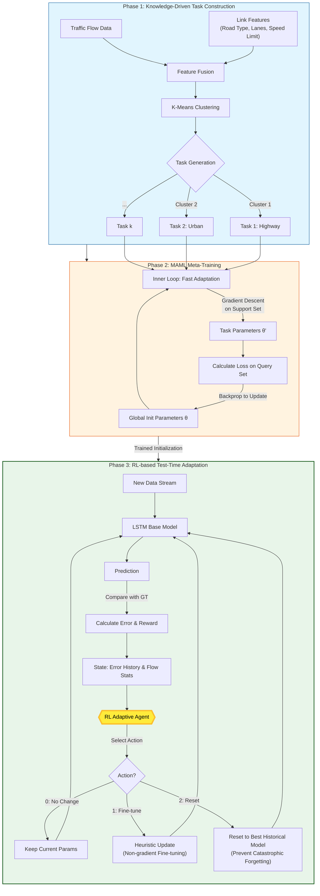

# Meta-LSTM Model Architecture

```mermaid
graph TD
    %% Phase 1: Knowledge-Driven Task Construction
    subgraph Phase1 [Phase 1: Knowledge-Driven Task Construction]
        direction TB
        DataFlow["Traffic Flow Data"] 
        LinkFeat["Link Features<br/>(Road Type, Lanes, Speed Limit)"]
        
        DataFlow & LinkFeat --> Fusion["Feature Fusion"]
        Fusion --> KMeans["K-Means Clustering"]
        
        KMeans --> Tasks{"Task Generation"}
        Tasks -->|Cluster 1| Task1["Task 1: Highway"]
        Tasks -->|Cluster 2| Task2["Task 2: Urban"]
        Tasks -->|...| TaskK["Task k"]
        
        style Phase1 fill:#e1f5fe,stroke:#01579b
    end

    %% Phase 2: MAML Meta-Training
    subgraph Phase2 [Phase 2: MAML Meta-Training]
        direction TB
        GlobalTheta["Global Init Parameters &theta;"]
        
        Task1 & Task2 & TaskK --> InnerLoop
        GlobalTheta --> InnerLoop["Inner Loop: Fast Adaptation"]
        
        InnerLoop -->|"Gradient Descent<br/>on Support Set"| LocalTheta["Task Parameters &theta;'"]
        LocalTheta --> CalcLoss["Calculate Loss on Query Set"]
        
        CalcLoss -->|"Backprop to Update"| GlobalTheta
        
        style Phase2 fill:#fff3e0,stroke:#e65100
    end

    %% Phase 3: RL-based Test-Time Adaptation (Core Innovation)
    subgraph Phase3 [Phase 3: RL-based Test-Time Adaptation]
        direction TB
        NewData["New Data Stream"] --> LSTM["LSTM Base Model"]
        LSTM --> Prediction["Prediction"]
        
        Prediction -->|"Compare with GT"| CalcReward["Calculate Error & Reward"]
        CalcReward --> State["State: Error History & Flow Stats"]
        
        State --> Agent{{"RL Adaptive Agent"}}
        
        Agent -->|"Select Action"| Decision{"Action?"}
        
        Decision -->|"0: No Change"| Keep["Keep Current Params"]
        Decision -->|"1: Fine-tune"| Update["Heuristic Update<br/>(Non-gradient Fine-tuning)"]
        Decision -->|"2: Reset"| Rollback["Reset to Best Historical Model<br/>(Prevent Catastrophic Forgetting)"]
        
        Keep --> LSTM
        Update --> LSTM
        Rollback --> LSTM
        
        style Phase3 fill:#e8f5e9,stroke:#1b5e20,stroke-width:2px
        style Agent fill:#ffeb3b,stroke:#fbc02d,stroke-width:4px,color:black
    end

    Phase1 --> Phase2
    Phase2 -->|"Trained Initialization"| Phase3
```
